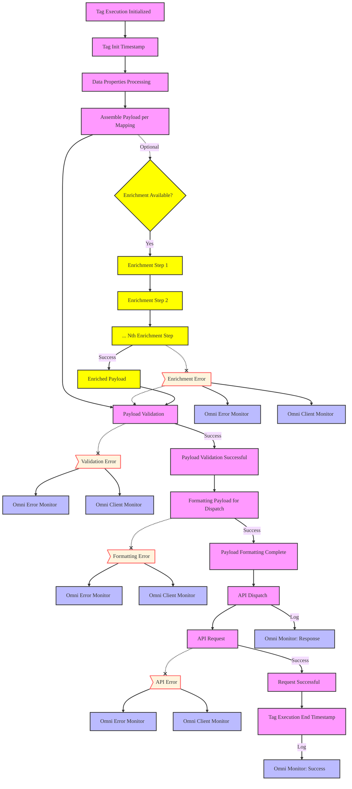

# Motivation

Traditional client-side tag management slows page loads, raises privacy risks, and limits data control. Omni CDI addresses these issues with a server-side activation layer through Omni Activation.

Omni Activation processes and activates data collected through our open-source, private infrastructure, which is deployed on the customer's servers. Activation occurs via Omni CDI tags deployed on these servers across dev, test, and prod environments. We integrate with server-side GTM, Segment (via custom functions), and are currently developing AWS Lambda tags.

## Key Benefits

- **Performance**: Cut client-side JavaScript to speed up page loads
- **Privacy**: Filter sensitive data before it leaves your infrastructure
- **Control**: Full visibility and control over data flow
- **Flexibility**: Custom integrations with any platform
- **Compliance**: Simplify GDPR and CCPA management

## Execution Flow

All Omni CDI tags follow a unified execution flow, offering complete visibility into data processing and tag execution. While slight variations may occur based on the environment, the core flow remains consistent. The diagram below shows this standard flow.

The execution flow of Omni CDI tags starts with the tag initialization and timestamp recording. Next, the data properties are processed, and the payload is assembled based on the defined mapping. The payload is then validated to ensure it meets the required standards.

If enrichment is available, the flow proceeds with optional enrichment steps. These steps are sequential and can include multiple stages. For example, the Omni Identity integration, already implemented in the [open-source full customer journey Meta API tag](/docs/activation/ssGTM/tags/meta-api), enriches the payload with additional customer data. If enrichment is successful, the payload is enhanced; if any enrichment step fails, the tag continues with the standard execution flow, and the error is logged with monitoring triggered.

Once the payload is validated, it's formatted for dispatch. If formatting fails, an error is logged, and monitoring is triggered. If successful, the payload is dispatched via an API request.

Finally, the request's success or failure is tracked. If successful, the tag execution ends, and success is logged. If an error occurs at any point, the appropriate error handling and monitoring steps are activated.

This diagram illustrates the standard execution flow for Omni CDI tags, highlighting each step and its corresponding error handling. For a detailed implementation example, check our [Meta Conversion API tag documentation](/docs/activation/ssGTM/tags/meta-api).